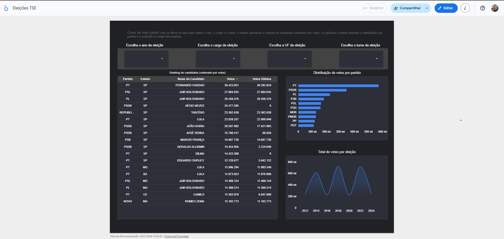

# Looker Studio — POC de Visualização

Esta pasta contém a Proof of Concept (POC) de visualização analítica
do estudo de **territorialização partidária**, baseada no Data Warehouse Eleitoral.

O objetivo desta POC é validar o consumo analítico do DW, garantindo
consistência de métricas, grain correto e navegabilidade para usuários finais,
independentemente da ferramenta de BI utilizada.

---

## 🎯 Objetivo

Validar o consumo do Data Warehouse Eleitoral a partir de uma ferramenta de BI,
confirmando que o modelo dimensional atual suporta análises exploratórias
e comparativas de forma consistente.

Esta POC tem foco no **consumo dos dados**, não na criação de uma camada
semântica corporativa.

---

## 🧱 Abordagem

- BigQuery como camada analítica
- Consumo da fact `fct_votacao_nominal` do mart `politics`
- View SQL denormalizada para facilitar o consumo em BI
- Looker Studio (versão gratuita) como ferramenta de visualização
- Ausência deliberada de Looker Enterprise / LookML

A modelagem dimensional e as regras de negócio permanecem concentradas
no Data Warehouse (dbt).

---

## 📊 Escopo do painel

O painel construído nesta POC contempla:

- Ranking de candidatos ordenado por votos
- Distribuição do total de votos por partido
- Evolução temporal do total de votos ao longo das eleições
- Filtros por:
  - Ano da eleição
  - Cargo
  - Turno
  - Unidade federativa (UF)

O painel foi desenhado para ser **autoexplicativo**, sem dependência
de tooltips ou documentação externa.

---

## 📈 Painel

🔗 **Link público do painel no Looker Studio:**  
> https://lookerstudio.google.com/reporting/73281798-b913-4e5c-924c-88ba2fb7bcdc/page/yxlmF 

📸 **Visão geral do painel:**

---

## 🧠 Observações

- Esta POC utiliza exclusivamente recursos gratuitos do Looker Studio.
- Não há uso de camada semântica LookML ou métricas centralizadas na ferramenta.
- O objetivo é validar o **Data Warehouse**, não a ferramenta de BI.
- O SQL da view utilizada pelo painel encontra-se versionado nesta pasta.

---

## 🚀 Próximos passos

- Evoluir o painel com recortes geográficos mais detalhados
- Criar novas páginas temáticas (ex: visão por partido ou por UF)
- Avaliar outras ferramentas de BI consumindo o mesmo DW
